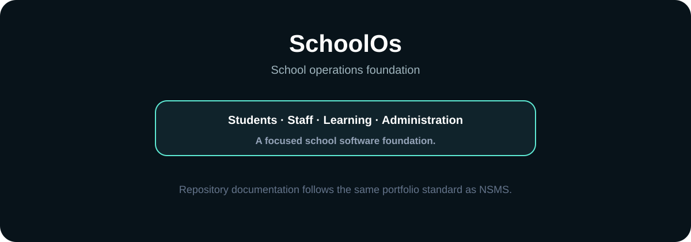

<div align="center">

# SchoolOs

**A focused school software foundation for modern education operations.**

[](#documentation-standard)
[](https://github.com/Olori24)

</div>



> **Repository status:** Early-stage repository. This README records what can be established from the repository itself and avoids presenting future plans as shipped functionality.

## Documentation standard

SchoolOs now follows the same README quality bar established for NSMS: product positioning, visual orientation, architecture, setup, evidence language, maturity tracking and roadmap separation.

| Evidence label | Meaning |
|---|---|
| **IMPLEMENTED** | Present in the repository. |
| **TESTED** | Supported by an executed test or CI result. |
| **DEPLOYED** | A deployment target/configuration exists. |
| **VERIFIED IN PRODUCTION** | Confirmed with production evidence. |
| **MEASURED** | Backed by an actual measurement. |
| **ROADMAP** | Planned work, not a shipped capability. |

## Product intent

SchoolOs is intended to provide a focused operating foundation for school administration, learning workflows and institutional coordination.

At this repository stage, no broader feature or production-readiness claim is made without implementation evidence.

## Architecture

The repository is currently being established as a dedicated school-software project. Architecture details should be updated here as application modules, persistence, authentication, integrations and deployment infrastructure are committed and verified.

```text
School user
    │
    ▼
Application UI
    │
    ▼
School operations
    │
    ├── Students
    ├── Staff
    ├── Learning
    └── Administration
```

## Maturity

| Area | Status |
|---|---|
| Repository foundation | IMPLEMENTED |
| Premium project documentation | IMPLEMENTED |
| Product architecture | EARLY / DOCUMENTED |
| Application capabilities | To be verified from implementation |
| Automated tests | To be verified |
| CI | To be verified |
| Production deployment | Not claimed |
| Production observability | Not claimed |

## Development

Detailed installation and test commands will be added when the executable application foundation is present.

For now, treat this repository as an early-stage project workspace rather than a production deployment claim.

## Roadmap

- [ ] Establish application architecture
- [ ] Define tenant and institution boundaries
- [ ] Add authentication and role controls
- [ ] Establish student/staff/learning domains
- [ ] Add persistence and migrations
- [ ] Add automated tests
- [ ] Add CI quality gates
- [ ] Add deployment pipeline
- [ ] Add security and operational runbooks
- [ ] Verify production readiness

## Engineering principles

1. Server-side authorization before client trust.
2. Tenant isolation where institutional data is shared.
3. Audit important operational actions.
4. Keep AI advisory unless a bounded action is explicitly authorized.
5. Test before claiming completion.
6. Separate implemented capability from roadmap intent.
7. Keep documentation synchronized with the repository.

## License

No license is asserted by this README unless a corresponding LICENSE file is present in the repository.

---

<div align="center">

**SchoolOs · Build the school operating foundation carefully.**

</div>
